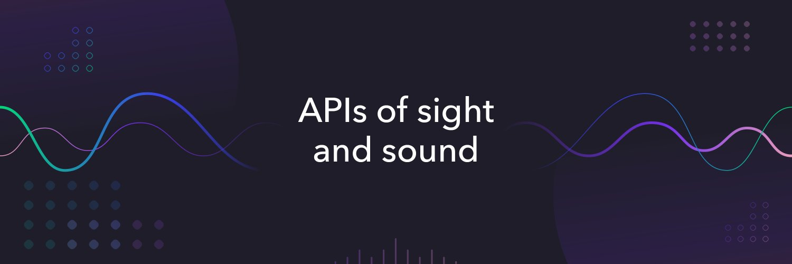

  

  
  &nbsp; &nbsp; &nbsp;
  
  &nbsp; &nbsp; &nbsp;
  
  &nbsp; &nbsp; &nbsp;

<h3>Dolby.io is the API platform for communications, streaming and media. </h2>
Learn how to integrate high-fidelity audio and video solutions into your real-time communications and file-based media processing applications. You can find the knowledge, documentation, tools and sample projects to help you get started.

